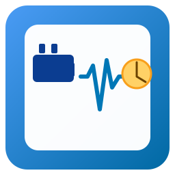

# ioBroker.watt-watcher

**Tests:** 

## watt-watcher adapter for ioBroker

Monitors smart-plug power to detect when appliances start and finish.

The watt-watcher adapter observes the power usage of smart plugs (e.g. Fritz!DECT, Shelly, Zigbee plugs) and determines the operating state of connected appliances such as washing machines, dryers, dishwashers, or any other energy-consuming devices.
By continuously polling the current wattage and applying configurable thresholds and timers, the adapter reliably detects when a device starts running, is temporarily paused, or has finished—even if the appliance’s power draw fluctuates during a cycle.

**Key Features**

- Detects start, running, and finished states based on power readings
- Handles short power drops (e.g. heating pauses in washing machines) with adjustable counters
- Optional auto-switch-off after a configurable period of inactivity
- Creates ioBroker states for status, current power, and timestamps, enabling automations and notifications

**Configurable Parameters**

For each monitored device you can set the following parameters.

| Parameter                | Description                                                                                                                   | Example                               |
| ------------------------ | ----------------------------------------------------------------------------------------------------------------------------- | ------------------------------------- |
| `name`                   | A friendly identifier for the appliance.                                                                                      | `washerwashing machine`               |
| `powerStateId`           | point that provides the current power usage in watts.                                                                         | `fritzdect.0.DECT_116300369609.power` |
| `powerStateId`           | point that provides the current power usage in watts.                                                                         | `fritzdect.0.DECT_116300369609.power` |
| `startThresholdWatt`     | Power (in watts) above which the device is considered “running”.                                                              | `30`                                  |
| `stopThresholdWatt`      | Power (in watts) below which the device is considered “stopped/finished”.                                                     | `5`                                   |
| `intervalSeconds`        | Polling interval in seconds – how often the adapter reads the current power.                                                  | `10`                                  |
| `startCounterLimit`      | Number of consecutive intervals **above** the start threshold before the device is marked as running.                         | `30` (≈ 5 min with 10 s interval)     |
| `stopCounterLimit`       | Number of consecutive intervals **below** the stop threshold before the device is marked as finished.                         | `15` (≈ 2.5 min with 10 s interval)   |
| `autoOffCounterLimit`    | Number of consecutive intervals below the stop threshold before the plug is automatically turned off (if enabled).            | `60` (≈ 10 min with 10 s interval)    |
| `switchOffAfterFinished` | Whether the adapter should switch the plug off automatically when the device is finished and the auto-off counter is reached. | `true` / `false`                      |

The watt-watcher adapter is ideal for automations like push notifications (“Washing machine finished!”), text-to-speech announcements, or triggering further smart-home routines when an appliance cycle ends.

## Changelog

<!--
	Placeholder for the next version (at the beginning of the line):
	### **WORK IN PROGRESS**
-->

### **WORK IN PROGRESS**

- (asc-ii) initial release

## License

MIT License

Copyright (c) 2025 asc-ii <adrian.schyja@gmail.com>

Permission is hereby granted, free of charge, to any person obtaining a copy
of this software and associated documentation files (the "Software"), to deal
in the Software without restriction, including without limitation the rights
to use, copy, modify, merge, publish, distribute, sublicense, and/or sell
copies of the Software, and to permit persons to whom the Software is
furnished to do so, subject to the following conditions:

The above copyright notice and this permission notice shall be included in all
copies or substantial portions of the Software.

THE SOFTWARE IS PROVIDED "AS IS", WITHOUT WARRANTY OF ANY KIND, EXPRESS OR
IMPLIED, INCLUDING BUT NOT LIMITED TO THE WARRANTIES OF MERCHANTABILITY,
FITNESS FOR A PARTICULAR PURPOSE AND NONINFRINGEMENT. IN NO EVENT SHALL THE
AUTHORS OR COPYRIGHT HOLDERS BE LIABLE FOR ANY CLAIM, DAMAGES OR OTHER
LIABILITY, WHETHER IN AN ACTION OF CONTRACT, TORT OR OTHERWISE, ARISING FROM,
OUT OF OR IN CONNECTION WITH THE SOFTWARE OR THE USE OR OTHER DEALINGS IN THE
SOFTWARE.
